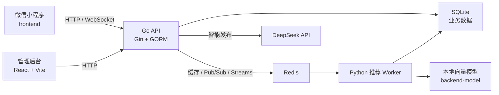

# Make Friends（找个伴儿）

一个面向线下活动和兴趣社交的完整应用。用户可以发布活动、报名或邀请其他人、进入活动群聊、完成履约结算与互评；系统再根据这些行为更新信誉数据和推荐结果。

仓库同时包含微信小程序、Go 后端、React 管理后台和 Python 推荐 worker，可用于完整产品联调，也可以单独学习各个子系统。

## 核心能力

- 活动发布、搜索、筛选、报名、取消和关闭
- 邀请日历、活动日历、站内消息和活动群聊
- WebSocket 实时消息与 SQLite 消息持久化
- 履约结算、互评、活动分和信誉积分流水
- DeepSeek 智能活动草稿
- 推荐曝光、点击、用户标签、向量召回和排序模型
- 用户、活动、审核案例、评价、积分和管理员账号管理

## 系统结构



Redis 在项目里承担三种不同职责：接口缓存、WebSocket 房间 Pub/Sub、推荐事件与任务 Streams。Redis 未启用时，基础 HTTP 接口和 SQLite 数据仍可独立运行，但实时聊天和异步推荐链路会受限。

## 技术栈

| 模块 | 技术 |
| --- | --- |
| 微信小程序 | 原生 JavaScript / WXML / WXSS |
| 后端 | Go 1.25、Gin、GORM、JWT |
| 数据库 | SQLite（WAL 模式） |
| 实时与队列 | Redis Cache、Pub/Sub、Streams、WebSocket |
| 管理后台 | React 18、React Router、Vite 5 |
| 推荐系统 | Python、PyTorch、Sentence Transformers、scikit-learn |
| 智能发布 | DeepSeek Chat API |

## 目录结构

```text
make_friends/
├── frontend/                  微信小程序
├── backend/
│   ├── cmd/                   服务、种子和修复命令
│   ├── internal/              API、模型、数据库、评分和推荐逻辑
│   ├── recommender/           Python 推荐 worker
│   ├── data/                  本地 SQLite 数据（不提交）
│   └── go.mod
├── admin-web/                 React 管理后台
├── backend-model/             本地向量模型目录（仅提交说明文件）
├── docs/                      数据库、智能发布和仓库规范文档
├── scripts/                   Windows PowerShell 编排脚本
└── start-*.bat / stop-*.bat   Windows 快捷入口
```

## 环境要求

基础开发：

- Git
- Go 1.25 或更高版本
- Node.js 18 或更高版本
- 微信开发者工具

启用完整能力时还需要：

- Docker（启动 Redis）
- Python 3.10
- Conda 或 venv
- 本地向量模型，放在 `backend-model/`
- 可用的 DeepSeek API Key（智能发布）
- 可用的腾讯位置服务 Key（地点搜索和逆地址解析）

## 快速开始

### 1. 克隆项目

推荐使用 SSH：

```bash
git clone git@github.com:kernel0627/make_friends.git
cd make_friends
```

### 2. 启动基础后端

不启用 Redis 时，后端可以直接运行：

```bash
cd backend
USE_REDIS=false go run ./cmd/server
```

PowerShell：

```powershell
cd backend
$env:USE_REDIS = "false"
go run ./cmd/server
```

后端默认监听 `http://127.0.0.1:8080`，首次启动会自动创建 `backend/data/app.db`、迁移数据表并补齐本地管理员账号。

检查服务：

```bash
curl http://127.0.0.1:8080/healthz
```

### 3. 启动管理后台

保持后端运行，另开一个终端：

```bash
cd admin-web
npm ci
npm run dev
```

访问 `http://127.0.0.1:5173`。默认 API 地址是 `http://127.0.0.1:8080`，可通过 `VITE_API_BASE` 覆盖。

管理员账号：

首次启动时，如果库里没有任何可用管理员，后端会自动创建一个 `admin` 账号。密码取自
`ADMIN_INIT_PASSWORD`；未设置时会随机生成一个并打印到启动日志里（只打印这一次），请登录后
立即修改。

后端不会再在每次启动时重建或改写已有账号，因此：

- 被软删除的管理员不会自动复活
- 占用了 `admin` 昵称的普通用户不会被自动提升为管理员
- 已有账号的密码不会被重置

如果你的库是从旧版本升级上来的，里面的 `admin` / `admin1` / `admin2` 仍然是旧的默认弱密码，
**请手动逐个改掉**。

### 4. 启动微信小程序

在微信开发者工具中直接导入 `frontend/` 目录。

小程序接口地址和地图配置位于 `frontend/utils/config.js`。该文件按环境分组，发布前把 `ENV`
改成 `'prod'`，并把 `prod` 段里的 HTTPS/WSS 域名填成实际部署地址：

```js
const ENV = 'dev'   // 发布前改成 'prod'

const ENV_CONFIG = {
  dev:  { API_BASE_URL: 'http://127.0.0.1:8080/api/v1', WS_BASE_URL: 'ws://127.0.0.1:8080/api/v1' },
  prod: { API_BASE_URL: 'https://example.com/api/v1',   WS_BASE_URL: 'wss://example.com/api/v1' },
}
```

聊天室会优先走 WebSocket（需要后端启用 Redis），连不上时自动降级为轮询。

仓库不会提交真实地图 Key。需要地点搜索时，请只在本地填写，并避免把 Key 提交到公共仓库。`frontend/project.private.config.json` 同样属于本机配置，已被 Git 忽略。

### 5. 启用 Redis、WebSocket 和推荐事件

先准备后端环境文件并启动 Redis：

```bash
cp backend/.env.example backend/.env
cd backend
docker compose up -d redis
USE_REDIS=true REDIS_ADDR=127.0.0.1:6379 WS_ENABLED=true go run ./cmd/server
```

Redis 启用后，聊天室 WebSocket、在线状态、接口缓存和推荐 Streams 才会进入完整工作模式。

### 6. 启动推荐 Worker（可选）

```bash
python3.10 -m venv .venv
source .venv/bin/activate
pip install -r backend/recommender/requirements.txt
cd backend
PYTHONPATH=. REC_DEVICE=cpu python -m recommender.worker
```

使用 GPU 时将 `REC_DEVICE` 改为对应设备，例如 `cuda`。全量重建向量和排序模型：

```bash
cd backend
PYTHONPATH=. REC_DEVICE=cpu python -m recommender.rebuild_all
```

## Windows 一键启动

只启动后端和管理后台：

```powershell
.\start-admin-system.bat
```

启动后端、Redis、推荐 worker 和管理后台：

```powershell
.\start-all.bat
.\status-all.bat
.\stop-all.bat
```

重新生成演示数据并重建推荐结果：

```powershell
.\start-all.bat -Reseed -RebuildRecommendations
```

完整栈脚本要求 Docker、Go、Node.js 和推荐运行环境可用。脚本优先查找仓库根目录的 `.venv`，也兼容名为 `make_friends_env` 的 Conda 环境，不依赖固定磁盘路径。

## 常用配置

| 配置 | 默认值 | 用途 |
| --- | --- | --- |
| `BACKEND_ADDR` | `:8080` | 后端监听地址 |
| `JWT_SECRET` | 开发默认值 | JWT 签名密钥。release 模式下若为空或仍是默认值，服务会直接拒绝启动 |
| `ADMIN_INIT_PASSWORD` | 空 | 首次创建 `admin` 时使用的密码；留空则随机生成并打印到日志 |
| `ENABLE_MOCK_LOGIN` | `false` | 是否开放 `/auth/mock-login`（免凭证换取 JWT，**仅限本地开发**） |
| `WECHAT_APP_ID` | 空 | 微信登录 App ID |
| `WECHAT_APP_SECRET` | 空 | 微信登录密钥 |
| `ADMIN_WEB_ORIGIN` | 空 | 额外允许的管理后台跨域来源，逗号分隔 |
| `RATE_LIMIT_AUTH_PER_MIN` | `20` | 登录/注册/刷新每分钟上限，按来源 IP 和账号名分别计数；`0` 关闭 |
| `RATE_LIMIT_SMART_DRAFT_PER_HOUR` | `30` | 每用户每小时智能草稿次数（每次都会调用付费 DeepSeek 接口）|
| `RATE_LIMIT_FEEDBACK_PER_MIN` | `120` | 推荐曝光/点击上报每分钟上限，按用户或 IP 计数 |
| `HOT_FEED_CANDIDATES` | `500` | 热门排序每次请求参与打分的最近活动数量上限 |
| `USE_REDIS` | `false` | 是否启用 Redis 能力 |
| `REDIS_ADDR` | `127.0.0.1:6379` | Redis 地址 |
| `REDIS_PASSWORD` | 空 | Redis 密码 |
| `WS_ENABLED` | `true` | WebSocket 开关；仍需 Redis 可用 |
| `DEEPSEEK_API_KEY` | 空 | 智能发布 API Key |
| `DEEPSEEK_BASE_URL` | `https://api.deepseek.com` | DeepSeek API 地址 |
| `DEEPSEEK_MODEL` | `deepseek-chat` | DeepSeek 模型 |
| `SMART_POST_TIMEZONE` | `Asia/Shanghai` | 智能发布时间解析时区 |
| `VITE_API_BASE` | `http://127.0.0.1:8080` | 管理后台 API 地址 |

后端环境变量示例见 `backend/.env.example`。不要提交真实 `.env`、数据库、私钥、模型文件或第三方 API Key。

## 主要接口

| 接口组 | 说明 |
| --- | --- |
| `GET /healthz` | 服务健康检查 |
| `/api/v1/auth/*` | 注册、登录、刷新令牌和当前用户 |
| `/api/v1/posts/*` | 活动列表、发布、报名、关闭、结算和评价 |
| `/api/v1/calendar/*` | 活动日历和邀请日历 |
| `/api/v1/chats/*`、`/api/v1/ws/chat` | 历史消息、发送消息和实时聊天（均需登录，且必须是该活动成员） |
| `/api/v1/recommendations/*` | 推荐曝光与点击反馈 |
| `POST /api/v1/posts/smart-draft` | DeepSeek 智能活动草稿 |
| `/api/v1/admin/*` | 管理后台接口 |

## 数据与安全

- SQLite 数据位于 `backend/data/app.db`，属于本地运行状态，不进入 Git。
- Go 后端启动时自动执行 GORM 迁移。
- 身份只来自签名 JWT；角色（是否管理员）一律以数据库为准，不信任令牌里的 role 声明。
- 聊天记录接口需要登录并校验活动成员身份，非成员和匿名访问都会被拒绝。
- 凭证接口、智能草稿和推荐上报都有限流，超限返回 `429` 并带 `Retry-After`。
- 请求体上限 1 MiB；5xx 只返回通用错误码，具体原因写进服务端日志，不回传给客户端。
- 镜像不再打包 `data/`，SQLite 库通过挂载卷提供（见 `docker-compose.yml`）。
- DeepSeek Key 只应保存在后端环境变量中，不能放到小程序代码里。
- 腾讯地图 Key 会在小程序客户端使用，应配置调用限制并避免提交到仓库。
- `backend-model/` 下的模型权重和下载缓存不会进入 Git。
- `.env`、日志、PID、构建产物、依赖目录和微信私有配置均由 `.gitignore` 排除。

## 测试与构建

Go 后端：

```bash
cd backend
go test ./...
go build ./...
```

微信小程序基础代码验证：

```bash
node frontend/verify-code.js
```

管理后台生产构建：

```bash
cd admin-web
npm ci
npm run build
```

Python 推荐模块测试（只依赖 scikit-learn，不需要 torch 或 Redis）：

```bash
cd backend && python -m pytest recommender/tests -q
```

## 进一步文档

- `backend/README.md`：后端入口、种子和修复命令
- `admin-web/README.md`：管理后台说明
- `backend/recommender/README.md`：推荐 worker 说明
- `docs/DATABASE-OVERVIEW.md`：数据库结构
- `docs/SMART-POST-DEEPSEEK.md`：智能发布协议
- `docs/REPO-HYGIENE.md`：仓库文件管理规范
